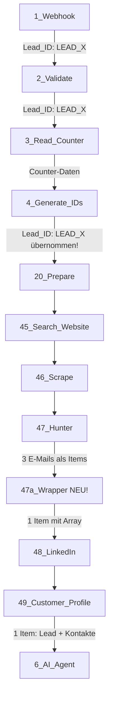

# 🎯 n8n Lead-Manager - Fix Zusammenfassung

## 🔴 HAUPTPROBLEME (Vorher)

| Problem | Auswirkung | Betroffene Nodes |
|---------|-----------|------------------|
| Lead_ID wird überschrieben | ❌ Doppelte Leads, Datenverlust | Node 4 |
| Hunter.io → mehrere Items | ❌ Sekundärkontakte = neue Leads | Node 47 → 48 |
| Keine Item-Aggregation | ❌ Mehrere Rows pro Lead | Node 49 |
| "undefined" in Feldern | ❌ Datenbank-Fehler, AI-Probleme | Alle Nodes |
| Fehlende Defaults | ❌ Unvollständige Datensätze | Node 2, 49 |

---

## ✅ LÖSUNGEN (Nachher)

### 1. **Lead_ID-Konsistenz** (Node 4)
```javascript
// VORHER:
const newLeadNumber = lastNumber + 1;
const leadId = `LEAD_${String(newLeadNumber).padStart(6, '0')}`;

// NACHHER:
let leadId = webhookData.Lead_ID || webhookData['Lead-ID'];
if (!leadId) {
  // Nur falls KEINE ID vorhanden → neu erstellen
  leadId = `LEAD_${String(newLeadNumber).padStart(6, '0')}`;
}
```

**Ergebnis:**
- ✅ Webhook-Lead_ID wird übernommen
- ✅ Nur bei fehlendem Wert → Generierung
- ✅ Logging zeigt Quelle an

---

### 2. **Hunter-Aggregation** (Neuer Node 47a)
```javascript
// VORHER:
47_Hunter → 48_LinkedIn  (Mehrere Items!)

// NACHHER:
47_Hunter → 47a_Wrapper → 48_LinkedIn  (1 Item!)

// Code:
const allEmails = [];
for (const item of items) {
  allEmails.push(item.json.email);
}
return [{ json: { hunter_data: { emails: allEmails } } }];
```

**Ergebnis:**
- ✅ Alle Hunter-E-Mails in einem Array
- ✅ Nur 1 Item weitergeleitet
- ✅ Keine Multi-Item-Probleme

---

### 3. **Single-Row Output** (Node 49)
```javascript
// VORHER:
return items.map(item => ({ json: ... }));  // Mehrere Items!

// NACHHER:
const firstItem = items[0];  // Nur 1 Item verwenden
// ... Aggregation ...
return [{ json: customerProfile }];  // IMMER 1 Item!
```

**Ergebnis:**
- ✅ Genau 1 Lead-Objekt pro Webhook
- ✅ Hunter-Kontakte in `contacts_found[]`
- ✅ Alle Datenquellen aggregiert

---

### 4. **Default-Werte** (Node 2, 49)
```javascript
// VORHER:
email: input.Email || null  // ❌ null

// NACHHER:
email: safeGet(input, 'Email', 'Nicht angegeben')  // ✅ Default
```

**Ergebnis:**
- ✅ Keine `null`, `undefined`, `""`
- ✅ Strings: `"Nicht angegeben"`
- ✅ Zahlen: `0`

---

## 📊 DATENFLUSS (Korrigiert)



---

## 🧪 VORHER/NACHHER VERGLEICH

### Szenario: Hunter findet 3 E-Mails

#### ❌ VORHER:
```
47_Hunter Output:
  Item 1: { email: "contact1@firma.de" }
  Item 2: { email: "contact2@firma.de" }
  Item 3: { email: "contact3@firma.de" }

49_Customer_Profile Output:
  Item 1: { Lead_ID: "LEAD_001", ... }
  Item 2: { Lead_ID: "LEAD_002", ... }  ❌ FEHLER!
  Item 3: { Lead_ID: "LEAD_003", ... }  ❌ FEHLER!
```

#### ✅ NACHHER:
```
47a_Wrapper Output:
  Item 1: {
    hunter_data: {
      emails: [
        { email: "contact1@firma.de" },
        { email: "contact2@firma.de" },
        { email: "contact3@firma.de" }
      ]
    }
  }

49_Customer_Profile Output:
  Item 1: {
    Lead_ID: "LEAD_001",
    customer_profile: {
      contacts_found: [
        { contact_id: "LEAD_001_SEC1", email: "contact1@..." },
        { contact_id: "LEAD_001_SEC2", email: "contact2@..." },
        { contact_id: "LEAD_001_SEC3", email: "contact3@..." }
      ]
    }
  }
```

---

## 📋 IMPLEMENTIERUNGS-CHECKLISTE

### Phase 1: Vorbereitung
- [ ] Workflow-Backup erstellen
- [ ] n8n-Version prüfen (min. 1.0+)
- [ ] Fix-Dateien herunterladen

### Phase 2: Code-Updates
- [ ] Node 2: Code ersetzen (`fixed_node_2_validate.js`)
- [ ] Node 4: Code ersetzen (`fixed_node_4_generate_ids.js`)
- [ ] Node 47a: Neuen Node erstellen (`fixed_node_47_hunter_wrapper.js`)
- [ ] Node 49: Code ersetzen (`fixed_node_49_customer_profile.js`)

### Phase 3: Verbindungen
- [ ] 47_Hunter → 47a_Hunter_Wrapper verbinden
- [ ] 47a_Hunter_Wrapper → 48_LinkedIn verbinden
- [ ] Alte Verbindung 47 → 48 entfernen

### Phase 4: Testing
- [ ] Test-Webhook mit Lead_ID senden
- [ ] Test-Webhook ohne Lead_ID senden
- [ ] Node 49 Output prüfen (1 Item?)
- [ ] Console-Logs prüfen
- [ ] Hunter-Kontakte in Array?

### Phase 5: Validierung
- [ ] Produktiv-Test mit echten Daten
- [ ] Datenbank auf Duplikate prüfen
- [ ] AI-Agent-Output validieren
- [ ] Performance-Monitoring

---

## 🎯 ERFOLGSKRITERIEN

| Kriterium | Messung | Ziel |
|-----------|---------|------|
| Items in Node 49 | Output-Count | **1** |
| Lead_ID-Quelle | Console-Log | "Webhook" |
| Hunter-Kontakte | `contacts_found.length` | ≥ 0 |
| Undefined-Strings | JSON.stringify() | **0** |
| Datenbank-Duplikate | SQL Query | **0** |

---

## 🚨 FEHLERBEHANDLUNG

### Fehler: "Lead_ID wird neu generiert"
```javascript
// Debug in Node 4:
console.log('Webhook-Daten:', webhookNode.json);
console.log('Lead_ID gefunden:', leadId);
console.log('Quelle:', leadId ? 'Webhook' : 'Generiert');
```

### Fehler: "Mehrere Items in Node 49"
```javascript
// Debug in Node 49:
console.log('Eingehende Items:', items.length);
console.log('Hunter-Kontakte:', hunterContacts.length);
console.log('Rückgabe-Items:', 1);  // Muss immer 1 sein!
```

### Fehler: "undefined im Output"
```javascript
// Debug in Node 49:
const profileStr = JSON.stringify(customerProfile);
if (profileStr.includes('undefined')) {
  console.error('⚠️ undefined gefunden in:', profileStr);
}
```

---

## 📞 SUPPORT-KONTAKTE

Bei Problemen:
1. **Console-Logs prüfen** (siehe Debugging-Guide)
2. **Workflow-Export** erstellen
3. **Error-Screenshots** anfertigen
4. **GitHub Issue** erstellen (mit Logs + Screenshots)

---

## 🎉 ERFOLG!

Nach erfolgreicher Implementierung:
- ✅ **1 Lead** pro Webhook
- ✅ **Lead_ID** bleibt erhalten
- ✅ **Hunter-Kontakte** als Sekundärkontakte
- ✅ **Keine Duplikate** in der Datenbank
- ✅ **Vollständige Profile** für AI-Agent
- ✅ **Saubere Daten** ohne "undefined"

**Workflow bereit für Produktion!** 🚀
