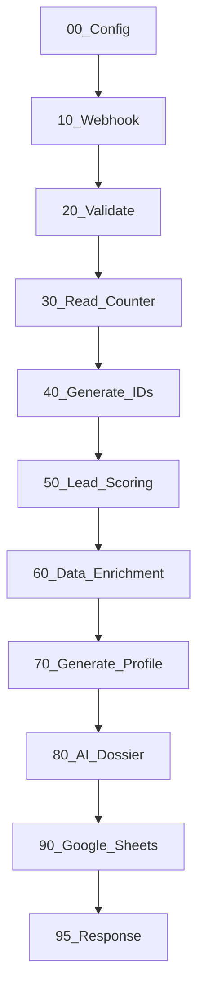

# 🎯 LEAD-MANAGER WORKFLOW - UNIVERSAL TEMPLATE

## 🌟 ÜBER DIESES TEMPLATE

Ein **vollständig konfigurierbares n8n-Workflow-Template** für professionelles Lead-Management in jeder Branche.

### ✨ Hauptfunktionen

- ✅ **Universal einsetzbar** - Einfach an jede Branche anpassbar
- ✅ **Vollautomatisch** - Von Webhook bis Google Sheets
- ✅ **Intelligentes Scoring** - Konfigurierbare Bewertungskriterien
- ✅ **Multi-Source Enrichment** - Website, Hunter.io, LinkedIn
- ✅ **Duplikats-Schutz** - Lead_ID-Konsistenz garantiert
- ✅ **Datenqualität** - Automatische Validierung & Defaults
- ✅ **Vollständig kommentiert** - Jede Zeile auf Deutsch erklärt
- ✅ **Production-ready** - Error Handling, Logging, Retries

---

## 📁 DATEI-STRUKTUR

```
SocialMediaManager/
│
├── nodes/                              # Alle Node-Codes
│   ├── 00_Config.js                    # ⭐ Zentrale Konfiguration
│   ├── 10_Webhook_Trigger.md           # Webhook-Dokumentation
│   ├── 20_Validate_Classify.js         # Datenvalidierung
│   ├── 30_Read_Counter.md              # Google Sheets Counter
│   ├── 40_Generate_IDs.js              # Lead-ID Generierung
│   ├── 50_Lead_Scoring.js              # Scoring & Qualifikation
│   └── 70_Generate_Profile.js          # Profil-Erstellung
│
├── SCHNELLSTART.md                      # ⭐ 15-Minuten-Setup
├── TEMPLATE_COMPLETE_WORKFLOW.md        # ⭐ Vollständige Doku
├── README_LEAD_MANAGER_TEMPLATE.md      # Diese Datei
│
├── fixed_node_*.js                      # Original-Fixes
├── FIX_SUMMARY.md                       # Fix-Dokumentation
└── WORKFLOW_STRUCTURE.md                # Workflow-Architektur

```

---

## 🚀 SCHNELLSTART (15 Minuten)

### Option 1: Express-Setup

```bash
# 1. Google Sheets vorbereiten
# → Siehe SCHNELLSTART.md Schritt 1

# 2. n8n öffnen, neuen Workflow erstellen

# 3. Node 00_Config importieren
# → nodes/00_Config.js kopieren

# 4. Deine IDs eintragen
# → Google Sheets ID, Folder ID

# 5. Weitere Nodes hinzufügen
# → 10, 20, 30, 40, 50, 70, 91

# 6. Testen!
curl -X POST https://deine-n8n.com/webhook/lead-intake \
  -H "Content-Type: application/json" \
  -d '{"Firmenname": "Test", "Email": "test@test.de"}'
```

### Option 2: Ausführliche Anleitung

➡️ **Lese `SCHNELLSTART.md`** für detaillierte Schritt-für-Schritt-Anleitung

---

## 🏢 BRANCHEN-ANPASSUNG

### Aktuell konfiguriert für:
**Batteriesysteme & Energietechnik**

### Andere Branchen (Beispiele):

#### 🖥️ **Software/SaaS**
**Hauptfelder:** Nutzeranzahl, Lizenzmodell, MRR
**Anpassungen:**
- `nodes/00_Config.js` Zeile 35-80
- `nodes/20_Validate_Classify.js` Zeile 142-186
- `nodes/50_Lead_Scoring.js` Zeile 40-70

#### 🏠 **Immobilien**
**Hauptfelder:** Quadratmeter, Zimmer, Kaufpreis
**Anpassungen:**
- Wie oben, aber mit Immobilien-Feldern

#### ⚙️ **Maschinenbau**
**Hauptfelder:** Produktionsvolumen, Maschinentyp, Wartungsintervall
**Anpassungen:**
- Wie oben, aber mit Maschinenbau-Feldern

#### 📱 **Beratung/Dienstleistung**
**Hauptfelder:** Mitarbeiterzahl, Umsatz, Beratungsbedarf
**Anpassungen:**
- Wie oben, aber mit Beratungs-Feldern

➡️ **Detaillierte Anleitung:** `TEMPLATE_COMPLETE_WORKFLOW.md` Kapitel "Konfiguration für neue Branchen"

---

## 📊 WORKFLOW-ÜBERSICHT



### Kern-Komponenten:

| Node | Funktion | Anpassbar? |
|------|----------|------------|
| **00_Config** | Zentrale Konfiguration | ⭐ JA - Hier alles einstellen! |
| **10_Webhook** | Lead-Eingang | Nein |
| **20_Validate** | Datenbereinigung | ⭐ JA - Branchenfelder |
| **30_Read_Counter** | ID-Zähler lesen | Nein |
| **40_Generate_IDs** | Lead-ID vergeben | Optional - Präfix ändern |
| **50_Lead_Scoring** | Bewertung | ⭐ JA - Scoring-Kriterien |
| **70_Generate_Profile** | Profil erstellen | ⭐ JA - Branchenfelder |
| **91_Write_Sheets** | Logging | Nein |

---

## 🔧 KONFIGURATION

### Schritt 1: Node 00_Config öffnen

Alle Template-Anpassungen erfolgen in **einer einzigen Datei**:

```javascript
// nodes/00_Config.js

// 1️⃣ UNTERNEHMEN
UNTERNEHMEN.name = "Deine Firma";
UNTERNEHMEN.branche = "Deine Branche";

// 2️⃣ BRANCHENFELDER
BRANCHENFELDER.deine_kategorie = {
  "Hauptfeld": { typ: "number", pflicht: true },
  "Nebenfeld": { typ: "string", pflicht: false }
};

// 3️⃣ SCORING-GEWICHTUNG (muss 100 ergeben!)
SCORING_GEWICHTUNG = {
  hauptkriterium: { gewicht: 40 },
  nebenkriterium: { gewicht: 30 },
  datenqualitaet: { gewicht: 20 },
  kontakt: { gewicht: 10 }
};

// 4️⃣ SCHWELLWERTE
LEAD_SCHWELLWERTE = {
  HOT: 8.0,
  WARM: 6.0,
  COLD: 4.0
};

// 5️⃣ GOOGLE SHEETS
GOOGLE_SHEETS.spreadsheet_id = "DEINE_ID";

// 6️⃣ GOOGLE DOCS
GOOGLE_DOCS.dossier_folder_id = "DEINE_FOLDER_ID";
```

### Schritt 2: Branchenfelder in weiteren Nodes anpassen

Siehe `TEMPLATE_COMPLETE_WORKFLOW.md` für detaillierte Anweisungen.

---

## 💡 FEATURES IM DETAIL

### 1. Lead_ID-Konsistenz

**Problem:** Doppelte Leads, Datenverlust

**Lösung:**
- Webhook Lead_ID wird IMMER übernommen (niemals überschrieben)
- Neue IDs nur wenn nicht vorhanden
- Vollständiges Audit-Trail

**Code:** `nodes/40_Generate_IDs.js`

---

### 2. Single-Row Output

**Problem:** Hunter.io liefert mehrere Items → mehrere Leads

**Lösung:**
- Aggregation aller Datenquellen zu 1 Lead-Objekt
- Sekundärkontakte in `contacts_found[]` Array
- Niemals mehrere Rows für denselben Lead

**Code:** `nodes/70_Generate_Profile.js`

---

### 3. Datenqualität

**Features:**
- ✅ Email-Validierung (Format, Business/Private)
- ✅ Telefon-Validierung
- ✅ Pflichtfeld-Prüfung
- ✅ Datentyp-Konvertierung
- ✅ Default-Werte (keine "undefined")
- ✅ Duplikats-Warnung

**Code:** `nodes/20_Validate_Classify.js`

---

### 4. Intelligentes Scoring

**Kriterien (konfigurierbar):**
1. Hauptkriterium (30 Punkte) - branchenabhängig
2. Projektvolumen (25 Punkte)
3. Datenvollständigkeit (20 Punkte)
4. Kontaktqualität (15 Punkte)
5. Dringlichkeit (10 Punkte)

**Kategorien:**
- **HOT** (≥8.0) → Sofortige Kontaktaufnahme
- **WARM** (≥6.0) → Qualifiziert für Vertrieb
- **COLD** (≥4.0) → Nurture-Kampagne
- **NURTURE** (<4.0) → Newsletter

**Code:** `nodes/50_Lead_Scoring.js`

---

### 5. Multi-Source Enrichment

**Datenquellen:**
- 🌐 **Website-Scraping** - Firmeninfo, Emails, Telefonnummern
- 📧 **Hunter.io** - Geschäfts-Emails & Kontakte
- 💼 **LinkedIn** - Unternehmensprofil, Mitarbeiter
- 🔍 **Google Search** - Firmendaten

**Output:** Aggregiertes Kundenprofil mit allen Infos

---

## 📚 DOKUMENTATION

| Datei | Zielgruppe | Inhalt |
|-------|------------|--------|
| **SCHNELLSTART.md** | Einsteiger | 15-Min-Setup, Basic-Config |
| **TEMPLATE_COMPLETE_WORKFLOW.md** | Fortgeschrittene | Vollständige Node-Doku |
| **nodes/00_Config.js** | Alle | Zentrale Konfiguration (kommentiert) |
| **nodes/20_Validate_Classify.js** | Entwickler | Datenvalidierung (Beispiele) |
| **nodes/50_Lead_Scoring.js** | Entwickler | Scoring-Logik |
| **nodes/70_Generate_Profile.js** | Entwickler | Profil-Erstellung |

---

## 🧪 TESTING

### Minimaler Test-Webhook

```bash
curl -X POST https://deine-n8n.com/webhook/lead-intake \
  -H "Content-Type: application/json" \
  -d '{
    "Firmenname": "Test GmbH",
    "Email": "test@test.de"
  }'
```

**Erwartung:**
- ✅ Lead_ID generiert
- ✅ Score berechnet
- ✅ In Google Sheets geloggt

### Vollständiger Test

```bash
curl -X POST https://deine-n8n.com/webhook/lead-intake \
  -H "Content-Type: application/json" \
  -d '{
    "Lead_ID": "LEAD_999999",
    "Firmenname": "Wichtiger Kunde GmbH",
    "Email": "ceo@wichtig.de",
    "Phone": "+49 123 456789",
    "Website": "https://wichtig.de",
    "Energieverbrauch_Jahr_kWh": 100000,
    "Projektziel": "Autarkie",
    "Investitionsrahmen": ">200k",
    "Kommentar": "Dringend"
  }'
```

**Erwartung:**
- ✅ Lead_ID "LEAD_999999" übernommen (nicht neu!)
- ✅ Hoher Score (≥8.0 → HOT)
- ✅ Website gescrapt
- ✅ Sekundärkontakte gefunden (Hunter)
- ✅ Vollständiges Profil
- ✅ Dossier erstellt
- ✅ Alle Sheets aktualisiert

---

## 🆘 SUPPORT & TROUBLESHOOTING

### Häufige Probleme

#### 1. "Lead_ID wird immer neu generiert"
**Ursache:** Webhook sendet keine Lead_ID
**Lösung:**
```javascript
// Webhook muss enthalten:
{ "Lead_ID": "LEAD_XXXXXX" }
// oder
{ "Lead-ID": "LEAD_XXXXXX" }
```

#### 2. "Mehrere Rows in Google Sheets"
**Ursache:** Node 70 gibt mehrere Items zurück
**Lösung:** Prüfe Console-Log von Node 70
```
✅ Kundenprofil erstellt für LEAD_X mit 3 Sekundärkontakten
```
Sollte nur 1x erscheinen pro Lead!

#### 3. "undefined in Feldern"
**Ursache:** Fehlende Defaults
**Lösung:** Prüfe Node 00_Config → DEFAULTS

#### 4. "Google Sheets Permission Error"
**Ursache:** Falsche Credentials
**Lösung:**
1. n8n → Credentials
2. Google Sheets OAuth2
3. Neu autorisieren

---

## 📈 ROADMAP & ERWEITERUNGEN

### Geplante Features (Optional):

- [ ] **Email-Automation** - Automatische Follow-ups
- [ ] **CRM-Integration** - HubSpot, Salesforce, Pipedrive
- [ ] **Advanced AI** - GPT-4 für Dossier-Erstellung
- [ ] **Duplicate Detection** - Fuzzy-Match für ähnliche Leads
- [ ] **Lead-Routing** - Automatische Vertriebszuweisung
- [ ] **Reporting Dashboard** - Grafana/Metabase Integration
- [ ] **Multi-Language** - i18n Support
- [ ] **Mobile App** - Lead-Ansicht für unterwegs

---

## 🤝 BEITRAGEN

Verbesserungsvorschläge willkommen!

1. Forke das Repository
2. Erstelle Feature-Branch
3. Committe Änderungen
4. Pull Request erstellen

---

## 📄 LIZENZ

MIT License - Frei verwendbar für kommerzielle & private Projekte

---

## 🙏 CREDITS

Entwickelt mit:
- **n8n** - Workflow-Automation
- **OpenAI GPT** - AI-Unterstützung
- **Google Workspace** - Sheets & Docs
- **Hunter.io** - Email-Finder

---

## 📞 KONTAKT & SUPPORT

- **Dokumentation:** Siehe Dateien im `/nodes/` Ordner
- **Issues:** GitHub Issues
- **Community:** n8n Community Forum

---

**Happy Lead Managing!** 🚀

*Version: 1.0.0*
*Erstellt: 2025-01-21*
*Template für: Jede Branche*
